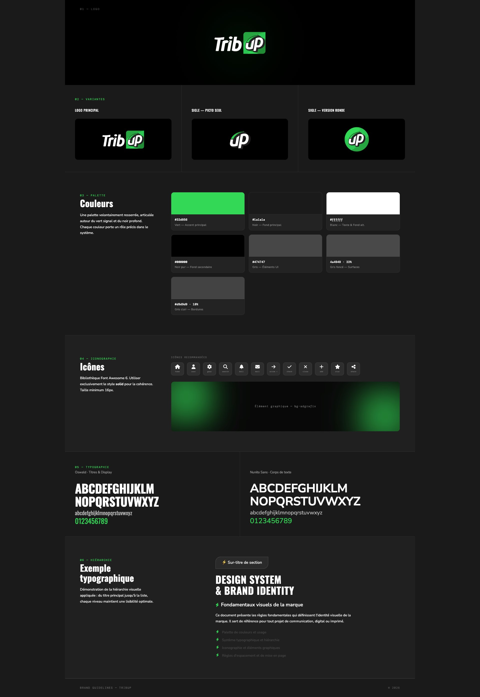

# TribUp — Brand Guidelines

Charte graphique officielle de la marque TribUp.

🔗 **[Voir la page en ligne](https://annuka-tribup.github.io/Tribup-Brandboard/)**

---

---

## Contenu

- **01** — Logo principal
- **02** — Variantes du logo (logo complet, picto, sigle rond)
- **03** — Palette de couleurs (`#32d856` · `#1a1a1a` · `#ffffff` · `#000000` · `#474747` · `#d9d9d9`)
- **04** — Iconographie (Font Awesome 6 Solid)
- **05** — Typographies (Oswald + Nunito Sans)
- **06** — Hiérarchie typographique

---

## Fichiers

| Fichier | Description |
|---|---|
| `index.html` | Page brand guidelines complète |
| `Tribup-logo-blanc (2).png` | Logo principal blanc |
| `Picto-UP-1 (2).png` | Picto / sigle seul |
| `6.png` | Sigle version ronde verte |
| `preview.png` | Capture d'écran de la page |
